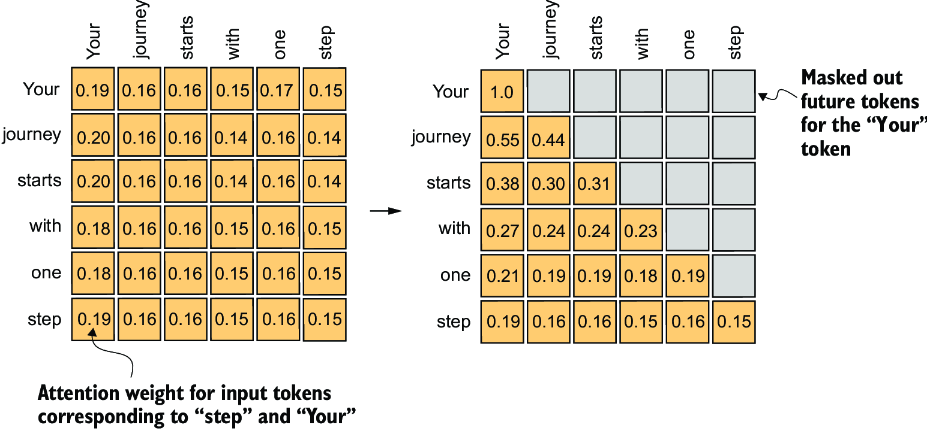
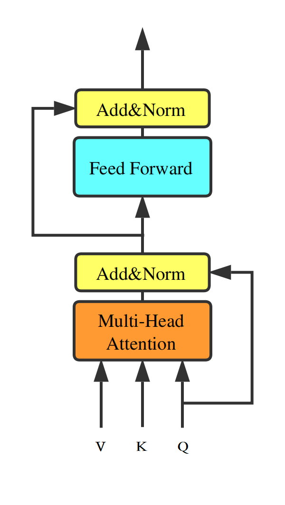
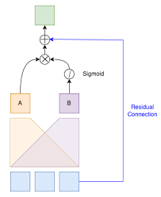
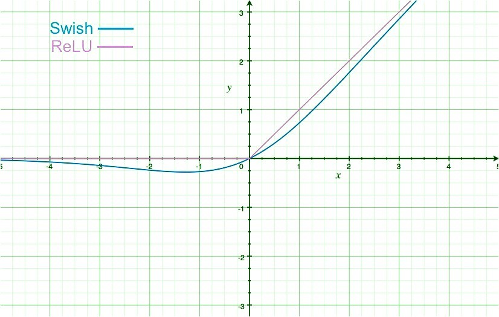

# Lyre, French mini LLM

---

## How to use it

---

## how it works

Our model is, at the begining, mainly inspired by the folowing articles and pages:
- [Attention Is All You Need](https://arxiv.org/pdf/1706.03762)
- [GPT2](https://huggingface.co/openai-community/gpt2)

The goal is to reproduce the GPT2 architecure in a miniLLM

### Main Ideas

#### Attention

The transformers are based on the idea of attention. The first time the idea of attention appeared was in 2014 with the paper [Neural machine translation by jointly learning to align and translate](https://arxiv.org/pdf/1409.0473) by D. Bahdanau. The goal at the beginning was to apply this to translation. In the same vein, the article from Google (Attention Is All You Need) was also applied to translation. So in this section we'll see how attention works, why it's useful for tasks like translation, then we'll see how we can modify it to use it to generate words.

When you write something the choice of the next words is linked to what you wrote before. For instance in the next sentence:

*The elephant tried to get into the car but he was too*

we know that the next word has a high chance to be *big* because a car is small compared to an elephant. We focused our attention on a few words: "elephant", "get into", "car" to predict the next word. Let's see how to build the same thing. In this case we need to ponderate each word according to the importance they have to find the next word.

**Query, Key, Value**

First in our example we want information about the next word after *too*. To do that we consider a query vector, which represents the element of interest or the context you want to obtain information about. The goal of this vector is to notice if there is a link between the embedding of the last word and the words in the context.

Naturally to compare the query vector with the other words we need vectors to compare each word with the query to see if the word is relevant for the query. Thanks to that we can ponderate each word.

Finally now that we have an idea of the importance of each word we can multiply the value of each word with the value vector.

Let's sum up. We want to see the link between the query $Q$ and the keys $K$ and finally we want to ponderate this value (between 0 and 1) so we are going to use a softmax. We have this equation $\text{softmax}(QK^{T})$. Now we multiply it by the Value and we have $\text{softmax}(QK^{T})V$ which is almost the equation of attention:

$$\text{softmax}\left(\frac{QK^{T}}{\sqrt{d_{k}}}\right)V$$

with $\sqrt{d_{k}}$ to have a stable variation of the sum of vectors (around 1).

At the end we have a vector of size $d_v$.

As you can see it's a very useful tool if we want to compare every word with every other word. In this case it's particularly useful for translation for instance. But we can modify the attention to produce a new type of attention to generate words.

**Causal Mask Attention**

To improve the speed of our training and generation we can directly compute a matrix product between all the words of our sentence. We multiply the key vectors and the query vectors of each word directly giving us a matrix of size $T \times T$ (where $T$ is the sequence length). However we put a mask on this matrix such that a query vector cannot be compared to the next words of the sentence. With that the model is trained to find the next word only using the previous ones.

*from https://medium.com/@sanjjam/beginners-guide-to-causal-attention-b2e3fa9bc762*

#### Transformers

**Transformer Block**

A Transformer block takes as input: Queries, Keys, and Values. They go through a multi-head attention layer and are then summed with the input shortcut to prevent gradient vanishing. 
After being normalized, the vectors go through a feed-forward layer. The goal of this layer is to extract higher-level features as we go deeper into the model.

*from https://www.researchgate.net/figure/The-structure-of-a-Transformer-Block_fig1_336224014*

**Positional encoding**

Finally, we have to introduce a mechanism to give importance to the position of every word in the sentence, since the multi-head attention layer does not account for order. To do that, we simply use a positional embedding layer which converts a token position into a learned vector.

### Improvements

To increase the performance per parameters, and particularlt to increase the batch size and the use of Vram, we introduces few modifications. Here it is the more important ones.

#### RoPE

This system is replacing the positional embedding layer. The RoPE system comes from this article [RoFormer: Enhanced Transformer with Rotary Position Embedding](https://arxiv.org/pdf/2104.09864).

Instead of learning a vector for every position, we compute it directly on the queries and keys before the computation of the attention. Let's give a hint of what we want to achieve. If we rotate the vector $q$ proportionally to its position $m$, and if we do exactly the same thing with the vector $k$ with its position $n$, then $q \cdot k$ should encode the relative position $m-n$. This is exactly what we want: the system learns its position directly from the vectors $q$ and $k$.

Let's introduce it in a more mathematical way:
We want $q \cdot k$ to encode the position $m-n$. To do that, we use the angle $\theta$. We do that for the $d/2$ pairs, where $d$ is the dimension.

$$\begin{pmatrix} q'_1 \\ q'_2 \end{pmatrix} = \begin{pmatrix} \cos(m\theta) & -\sin(m\theta) \\ \sin(m\theta) & \cos(m\theta) \end{pmatrix} \begin{pmatrix} q_1 \\ q_2 \end{pmatrix}$$

$$\begin{pmatrix} k'_1 \\ k'_2 \end{pmatrix} = \begin{pmatrix} \cos(n\theta) & -\sin(n\theta) \\ \sin(n\theta) & \cos(n\theta) \end{pmatrix} \begin{pmatrix} k_1 \\ k_2 \end{pmatrix}$$

In our code, this part is done by `precompute_rope` in `archi.py`.

Now that we have that, we can apply it to encode the relative position:

$$
q' \cdot k' = (q_1 k_1 + q_2 k_2) \cos((m-n)\theta) + (q_1 k_2 - q_2 k_1) \sin((m-n)\theta)
$$

RoPE has several advantages; one of them is the fact that we can train our model on `MAX_LEN`, but at inference, we can increase this value to handle more context.

#### SwiGLU

To understand the activation function SwiGLU, we have to understand two things: GLU and Swish.

*GLU - Gated Linear Unit*

This activation function is mostly used in NLP and it's inspired by the gating mechanisms we can find in LSTMs and GRUs.
Thus, the goal is to filter a part of the data and to keep the other part intact. To do that, we have to split it like that:

$$GLU(x) = (x \cdot W_1 + b) \otimes \sigma(x \cdot W_2 + c)$$

*from https://medium.com/@sanket.nadargi1/gated-linear-unit-1622bf8e3ce7*

*Swish*

is an activation function defined by:

$$Swish(x) = x \cdot \sigma(x)$$

The function is like ReLU but negative for $x < 0$.

*from https://www.geeksforgeeks.org/machine-learning/ml-swish-function-by-google-in-keras/*

*SwiGLU*

Now we merge both:

$$SwiGLU(x) = (x \cdot W_1 + b) \otimes Swish(x \cdot W_2 + c)$$

$$SwiGLU(x) = (x \cdot W_1 + b) \otimes (\sigma(x \cdot W_2 + c) \cdot (x \cdot W_2 + c))$$

#### RMSNorm

From [Root Mean Square Layer Normalization](https://arxiv.org/pdf/1910.07467)

The goal of the normalization layer is to prevent gradient explosion or gradient vanishing by rescaling (variance 1) and recentering (mean 0). RMSNorm is another normalization layer which tries to be simpler and faster by just rescaling.

The LayerNorm looks like:

$$
LayerNorm(x_i) = \frac{x_i - \mu}{\sigma} \cdot \gamma_i + \beta_i
$$

Here, $\mu$ and $\sigma$ are computed over every dimension, and $\gamma_i$ and $\beta_i$ are the learned parameters.

Zhang and Sennrich observed that the division by the norm stabilizes the training, not the subtraction. Thus, they propose removing the computation of the average and just computing the root mean square.

$$
RMS(x) = \sqrt{\frac{1}{d} \sum_{i=1}^{d} x_i^2}
$$

$$
RMSNorm(x_i) = \frac{x_i}{RMS(x)} \gamma_i
$$

We have to learn fewer parameters thanks to this technique.

#### GQA

---

## RAG

### Why a good Retriever is very important for this project

### Lyre embedding what's the difference with the Generator of text Lyre

---
## Summary of my choices